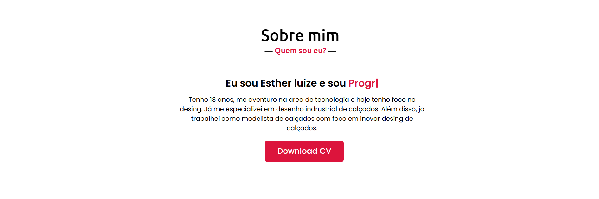
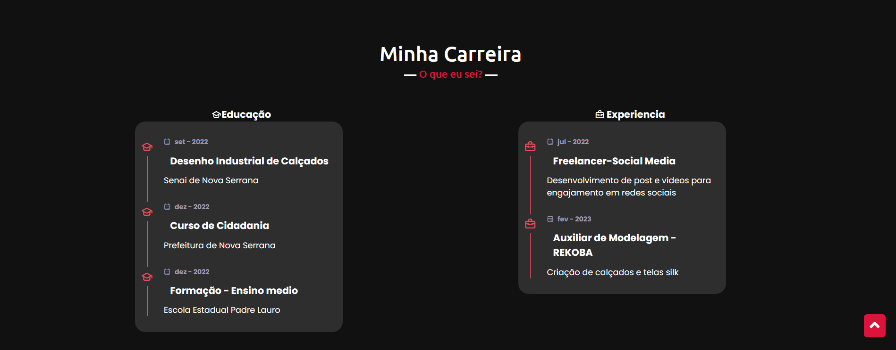
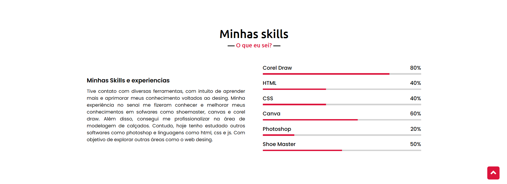
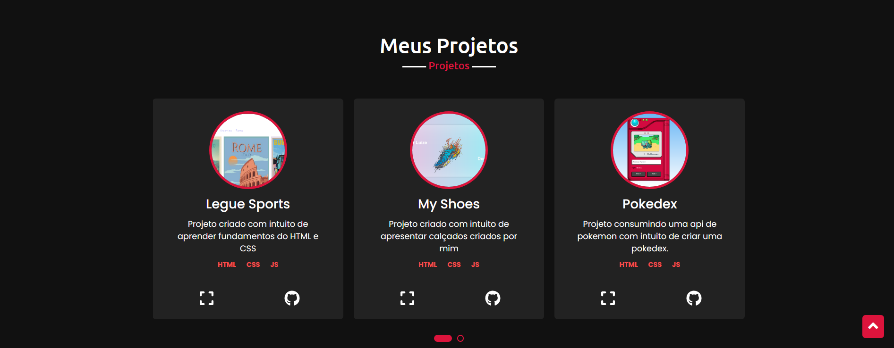
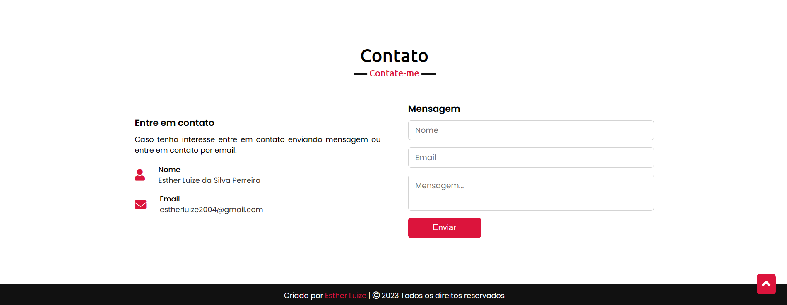

<h1 align="center"> 👩‍🎨 Portifólio 👩‍🎨</h1>

## Sobre o Projeto 🚀
Portifolio criado para demontrar um pouco sobre mim, sobre minhas skills, carreira e projetos.

## Tecnologia 💻
-  - HTML

-  - CSS

-  - JS

#
## Considerações 🚧

- Para visualizar o site acesse o link: https://estherluize.netlify.app
 
- Dê uma ⭐ se você gostou deste site!
